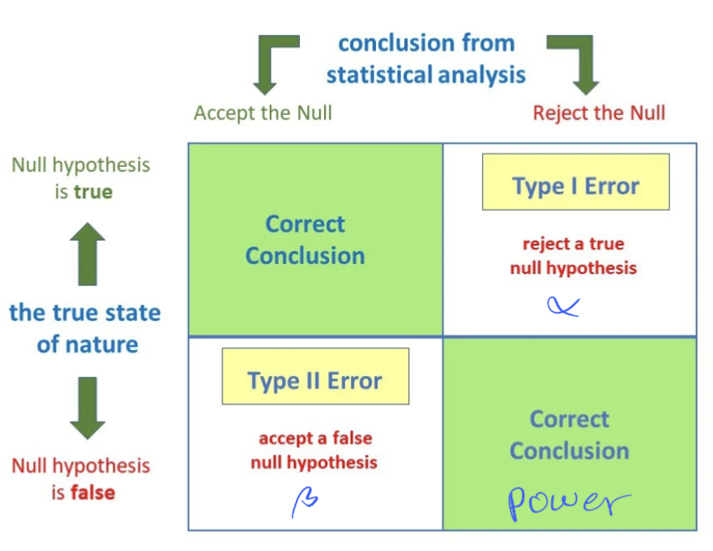
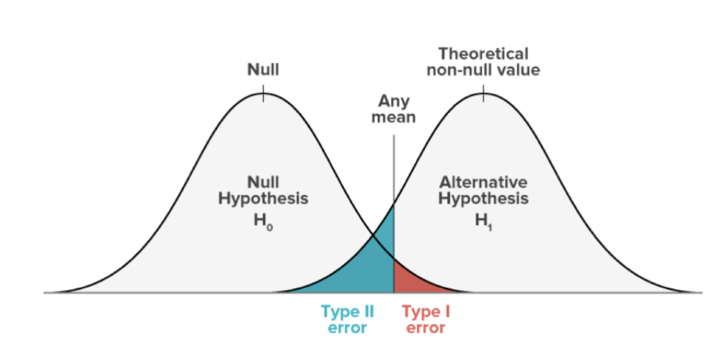

# Monday, March 25 Week 11-1

## Hypothesis Testing

- In the scientific method, a hypothesis is a proposed explanation made on the basis of limited evidence as a starting point for further investigation
- In statistics, a hypothesis is a specific claim regarding a population parameter, $\mu, \sigma, p, ...$

### Example: Coin Toss:

- Null Hypothesis: $H_0: P(H) = 0.5$, also known as the *status quo* or *default position*
- Alternate Hypothesis: $H_1: P(H) > 0.5$
- Consider a sample of tosses, $x_1, x_2, ..., x_n$

- Possible outcomes based on the sample:
  - We would reject $H_0$ if the evidence is strong against the null
  - Fail to reject $H_0$ if the evidence is not strong enough i.e. we maintain the null hypothesis
    - Note that a sample alone cannot provide absolute certainty on its population

## General Setup of Hypothesis Testing

- **Formulating Hypotheses:**

- Null Hypothesis: $H_0:$ represents the setatus quo or a default position
- Alternate Hypothesis: $H_1:$ represents the claim that we are testing that is contrary to the null

**Testing Process:**
- Based on the sample $x_1, x_2, ..., x_n$, we decide wether to
  - Reject $H_0$ in favor of $H_1$
  - Fail to reject $H_0$, maintaining the **status quo**. Rejecting $H_0$ may become more likely with additional information.

## Type I and II Errors

- **Type I Error (False Positive):**
- Occurs when the null hypothesis $H_0$ is incorrectly rejected (so the null is true, but we reject it)
- This is denoted by $\alpha$ which is the probability of commiting a Type I error.
- Also known as the "level of significance"

**Type II Error (False Negative):**

- Occurs when the null hypothesis $H_0$ is incorrectly accepted (so the null is false, but we accept it)
- This is denoted by $\beta$ which is the probability of commiting a Type II error.
- Indicates a missed opportunity to adopt the alternative hypothesis when it is actually true.

**Balancing Errors**
- A lower $\alpha$ reduces the change of a Type I error but may increase the chance of a Type II error and vice versa.
- The choice of $\alpha$ often depends on the consequences of making each type of error: 
  - e.g. Covid tests manufacturers might want to increase the chance of a false positive in favour of a false negative. The consequences of someone who is falsely diagnosed with Covid are less severe than someone who is falsely diagnosed as not having Covid. Thus, we would increase $\alpha$

### Example: Calculating the Type I Error

- Null Hypothesis: $H_0: \mu = 1000 \text{MPa}$
- Alternative Hypothesis: $H_1: \mu \neq 1000 \text{MPa}$
- Given a sample $x_1, ..., x_{25}$ with mean $\bar{x}$, assume the standard deviation is $\sigma = 50$

- We know that $P(H_0) = P (\mu = 1000) = 0$, since the null hypothesis is a point hypothesis, so we need a range that we can measure:
  - Let $990 < \bar{x} < 1010$ be the interval where we don't reject the null $H_0$
  - The **critical region** is the complement of $[990, 1010]$, leading to the rejection of $H_0$.
    So what is the probability associated with this region

**Solution**
- With $n = 25$ and $\sigma = 50$ we find the z-score of the critical region.
$$ P(990 < \bar{X} < 1010) = P(\frac{990 - 1000}{50/\sqrt{25}}) < z < \frac{1010 - 1000}{50/\sqrt{25}}) \rightarrow P(-1 < z < 1) = 0.68$$

- Thus, the probability that we fail to reject the null hypothesis is $0.68$ and the probability of rejecting the null hypothesis is $1 - 0.68 = 0.32$. 
- $\alpha = 0.32$ is not great; this means that*the null hypothesis $H_0$ is rejected $32 \%$ of the time. 
- **Assuming the null to be true, we are wrong $32\%$ of the time.**
- We reject the null hypothesis when it is true $32\%$ of the time.

- To reduce this chance, we could increase the critical interval for our null hypothesis

### Example: Calculating the Type II Error

- Calculate the probability of failing to reject the null when it is false $\beta$ (i.e. how likely is it that the null is wrong when we assume it to be true). Consider $\mu = 1020$ (alternative hypothesis $H_1$) and $990 <\bar{x} < 1010$ which is the null hypothesis $H_0$.

**Solution:** We wish to find when the alternative hypothesis is true. From there, we can determine the values that would lie within the null hypothesis: in this overlap, we would fail to reject the null hypothesis incorrectly.

- $\beta$, is the area of the alternative hypothesis normal of 990 to 1010, using $\mu = 1020$.
- We can find the z-scores of the interval $990 < \bar{X} < 1010$ using $\mu = 1020$ and $\sigma = 50$.

$$\beta = P(990 < \bar{X} < 1010) = P(-3 < z < -1) = 0.1574$$ when $\mu = 1020$

- So there is a $15.74$ chance of commiting a type II error. So 15.74% of the time, we fail to reject the null hypothesis when it is false. 

## Recap

## Statistical Power
- The power of a test is the probability that the test correctly rejects the null (H_0) when a sepcific alternative hypothesis (H_1) is true. Mathematically, it is expressed as $1 - \beta$ where $\beta$ is the probability of a Type II error.
