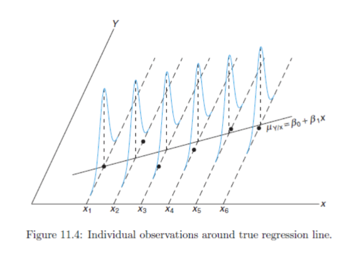
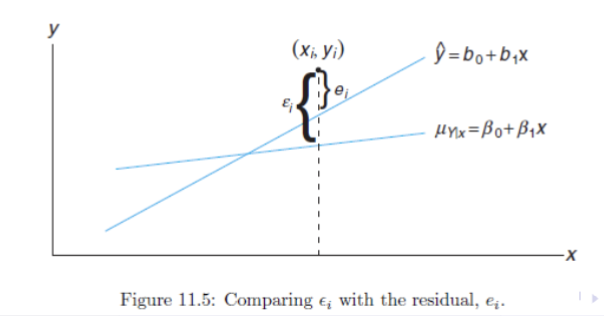

# Tuesday, April 9 Week 13-1

## Function Approximation: 

**Basic Setup**: 
- Input/output pairs: $(x_i, y_i)$ where $i = 1, 2, \ldots, n$
- We want to find a function $y = f(x)$ that minimizes the error: $e_i = y_i - f(x_i$

**Types of function approximators**:
- Linear: $y = ax + b $
- There are nonlinear functions as well 
- Classification functions: 
    - $x \in \mathbb{R}, y \in \{0, 1\}$

## Linear Regression:
A form of a relationships between the response variable $Y$ and the regressor variable $x$ is the linear relationship. 

$$Y = \beta_ 0 + \beta_1x$$

Where $\beta_0$ is the intercept and $\beta_1$ is the slope. If the relationship is exact, then the relationship is called deterministic, and there is no random or probabilistic component to it. 

## Simple Linear Regression Model:
Where $\epsilon$ is the random error term with $E(\epsilon) = 0$ and $\text{Var}(\epsilon) = \sigma^2$. $\epsilon \sim N(0, \sigma^2)$

$$Y = \beta_0 + \beta_1 x + \epsilon$$

This model implies: 
- The response variable $Y$ is not determinisitic but involves randomness due to $\epsilon$
- The regressor is assumed to be measured without significant error: $\text{Var}(x) = 0$
- The random error $\epsilon$ is assumed to have a constant variance, an assumption known as homoscedasticity. 
- The linear model ensures that the y values are distributed around the population regression line $y = \beta_0 + \beta_1 x$. If the model fits well, it captures the essence of the data, allowing for both positive and negative deviations. 

At a given $x, Y$ and the corresponding $\epsilon$ both have some variance $\sigma^2$ 

where $\mu_{Y | x} = \beta_0 + \beta_1 x$ is the true tregression line 

## The Fitted Regression Line
The aim of the regression analysis is to estimate the parameters $\beta_0$ and $\beta_1$ such that the sum of the squared differences between the observed and predicted values is minimized. 
$$\hat{y} = b_0 + b_1 x$$ 

where $\hat{y}$ is the predicted value of $Y$ for a given value of $x$.

### Residual Error in Regression
Given a data set for regression $\{(x_1, y_1), (x_2, y_2), \ldots, (x_n, y_n)\}$, and some fitted model $\hat{y_i} = b_0 + b_1 x_i$, the error at i $e_i$ is defined as: 
$$e_i = y_i - \hat{y_i}, i = 1, 2, \ldots, n$$ 

These are known as residuals, we aim to minimize the error between our model and the actual data. 

### Estimating the Regression Coefficients:
The errors are 
$$e_i = y_i - \hat{y_i} = y_i - b_0 - b_1 x_i$$

We wish to minimize the sum squared error: 
$$\sum_{i=1}^{n} e_i^2 = \sum_{i=1}^{n} (y_i - b_0 - b_1 x_i)^2$$

We wish to solve for $b_0$ and $b_1$ that minimize SSE:

$$\frac{\partial}{\partial b_0} \sum_{i=1}^{n} (y_i - b_0 - b_1 x_i)^2 = 0$$

and 

$$\frac{\partial}{\partial b_1} \sum_{i=1}^{n} (y_i - b_0 - b_1 x_i)^2 = 0$$

Now,we rearrange to obtain 'normal equations' 

$$nb_0 + b_1 \sum_{i=1}^{n} x_i = \sum_{i=1}^{n} y_i$$

$$b_0 \sum_{i=1}^{n} x_i + b_1 \sum_{i=1}^{n} x_i^2 = \sum_{i=1}^{n} x_i y_i$$

Now we can solve for $b_0$ and $b_1$

$$b_0 = \frac{\sum_{i=1}^{n}y_i - b_1 \sum_{i=1}^{n} x_i}{n} = \bar{y} - b_1 \bar{x}$$

$$b_1 = \frac{n \sum_{i=1}^{n} x_i y_i - \sum_{i=1}^{n} x_i \sum_{i=1}^{n} y_i}{n \sum_{i=1}^{n} x_i^2 - (\sum_{i=1}^{n} x_i)^2} = \frac{\sum_{i=1}^{n}  (x_i - \bar{x})((y_i - \bar{y})}{\sum_{i=1}^{n} (x_i - \bar{x})^2}$$

### Example 1: 
Estimate the regression line given the following sums: 
- $\sum_{i=1}^{33} x_i = 1104$ 
- $\sum_{i=1}^{33} y_i = 1124$
- $\sum_{i=1}^{33} x_i y_i = 41355$
- $\sum_{i=1}^{33} x_i^2 = 41086$

**Solution**
- $b_1 = \frac{33 * 41355 - (1104)(1124)}{33 * 41086 - 1104^2} = 0.903$
- $b_0 = \frac{1124 - b_1 * 1104}{33} = 3.8230$
- $\hat{y} = 3.8230 + 0.903x$

## Mean and Variance of Estimators
For the random variable $B_1$ 

$\mu_{B_1} = E(B_1) = \beta_1$

$$\text{Var}(B_1) =\frac{ \sigma^2}{ \sum_{i=1}^{n} (x_i - \bar{x})^2}$$

And for $B_0$:
$\mu_{B_0} = E(B_0) = \beta_0$

$$\text{Var}(B_0) = \frac{\sigma^2 \sum_{i=1}^{n} x_i^2}{n \sum_{i=1}^{n} x_i^2 - (\sum_{i=1}^{n} x_i)^2}$$

**Analogies**: 
$$\bar{X} \rightarrow B_1, B_0$$
$$\bar{x} \rightarrow \beta_1, \beta_0$$
$$ E(\bar{X}) \rightarrow E(B_1), E(B_0)$$
$$ \text{Var}(\bar{X}) = \frac{\sigma^2}{n} \rightarrow \text{Var}(B_1)= \sigma^2_{B_1}, \text{Var}(B_0) = \sigma^2_{B_0}$$

